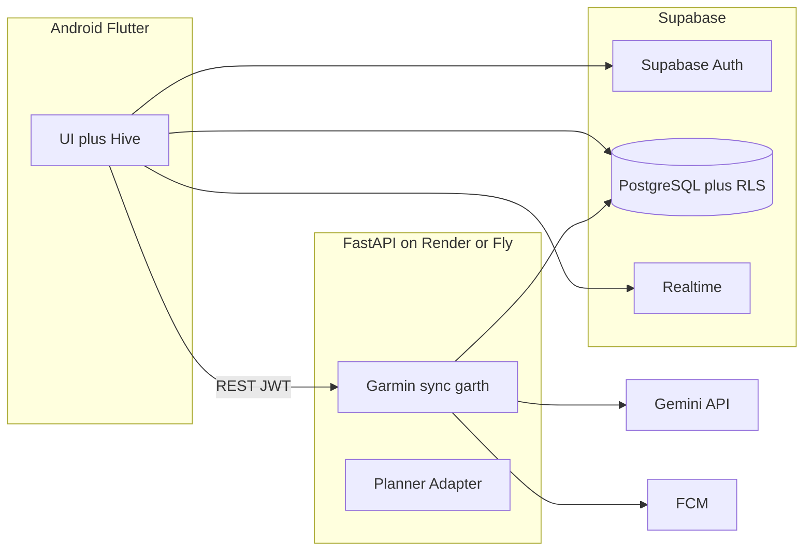
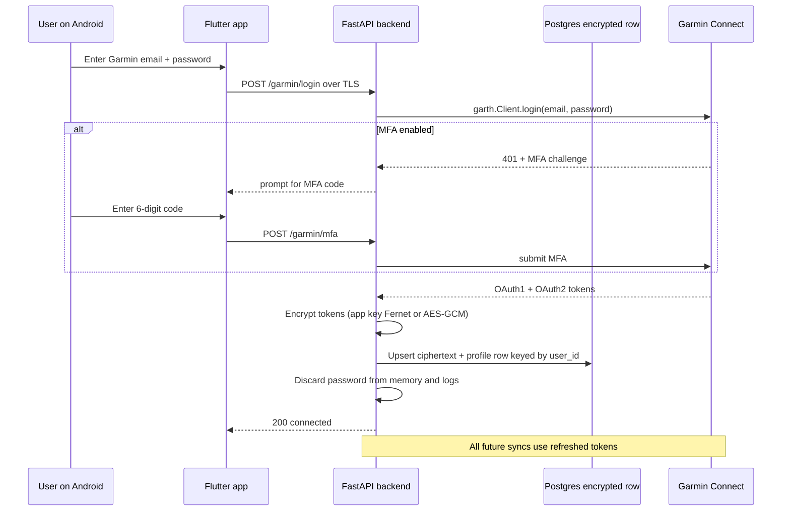

# DynamicRunner — Product Requirements Document

**Version:** 0.1 (MVP)
**Owner:** Adin
**Last updated:** 2026-05-06
**Status:** Draft for review

---

## 1. Vision & positioning

DynamicRunner is an Android app that gives recreational and serious runners an always-on, adaptive coach. Where TrainingPeaks and Final Surge are calendar-and-template tools that require a human coach (or a lot of self-knowledge) to be useful, DynamicRunner generates a periodized race plan from the user's own Garmin history and **changes that plan every week — and every day if needed** — based on real recovery, training-load, and performance signals coming back from the watch.

**Tagline:** *Your training plan, rewritten every morning.*

**Why now:** Garmin watches now stream a rich physiological dataset (HRV, body battery, training status, VO2max, race predictor). Generative models are finally good enough to reason over that data and produce coherent, periodized plans with explanations. Combining the two removes the biggest friction in self-coached running: knowing what to do *today* in light of what happened *yesterday*.

## 2. Target user

- Primary: 25–45 year old recreational-to-serious runners training for a specific race (5K up to ultramarathon).
- Owns a Garmin watch (Forerunner, Fenix, Venu, Epix, etc.) — Garmin connection is **mandatory** in the MVP.
- Currently uses one of: free Garmin Coach, a static PDF plan, a paid app like Runna/Stryd, or a human coach they're outgrowing.
- Comfortable with structured workouts and pace/HR targets.

Out-of-scope users for MVP: triathletes, cyclists-only, beginners with no running base, users without a Garmin device.

## 3. MVP scope (3-month build)

In scope:

1. Mandatory Garmin Connect authentication during onboarding.
2. 90-day Garmin history backfill (activities, sleep, HRV, resting HR, body battery, stress, VO2max, race predictions).
3. Race goal definition: event type (5K / 10K / half / marathon / ultra), date, target time or pace, available training days per week, preferred long-run day, optional secondary races.
4. AI-generated, fully-periodized race plan with weekly structure and structured daily workouts.
5. Push structured workouts to the user's Garmin watch as native Garmin Connect workouts.
6. Post-workout RPE + feeling check-in (1-tap, 5 seconds).
7. Event-driven adaptation: missed workout reschedules to the next eligible day; significant deviations (HRV drop, poor sleep, slow workouts, elevated load) trigger workout adjustments.
8. Automatic weekly review at the start of each training week.
9. Basic dashboard: today's workout, this week's plan, training-load trend, HRV trend, plan progress.

Out of scope for MVP (see roadmap):

- iOS, Wear OS companion, web app
- Triathlon, cycling, strength, nutrition
- Coach view / share with coach
- Social features, peer groups, leaderboards
- Monetization / subscription paywall
- Localization (English only at launch)

## 4. Key user flows

### 4.1 First-time onboarding (target: <8 minutes)

1. Sign in with Google or email/password (**Supabase Auth**; Google as a federated OIDC identity provider).
2. Connect Garmin: enter Garmin email + password (and MFA code if enabled). See Section 9 for the full security flow.
3. Backfill progress screen: "Pulling your last 90 days from Garmin… (3 of 47 activities synced)". Completes in 30–90 seconds depending on history size.
4. Quick profile: age, sex, weight, injury history (free text), recent races (auto-detected from Garmin, user confirms).
5. Race goal: pick race type → pick date → pick goal pace (auto-suggested from Garmin race predictor) → pick training days/week → pick long-run day.
6. Review the proposed plan summary (e.g., "16 weeks, peak week 78 km, 4 quality sessions per week"). One tap to accept, or "regenerate with different parameters".
7. First workout pushed to Garmin watch immediately.

### 4.2 Daily app open

- Top of screen: today's workout, with structured intervals laid out, target paces and HR zones.
- "Push to watch" button (or auto-pushed overnight).
- Below: yesterday's check-in summary if not yet done; this week at a glance; readiness signal (green/amber/red) derived from HRV + sleep + body battery.

### 4.3 Post-workout check-in

- Triggered by FCM push 30 minutes after workout sync from Garmin.
- 5-second flow: RPE slider 1–10, feeling chip (Great / Good / Flat / Sore / Wrecked), optional note.
- Submitted data feeds the adaptation engine.

### 4.4 Missed workout

- "Missed" defined as: no Garmin activity matching the prescribed workout type within 24h of the scheduled time.
- Default rule: the missed workout moves to the **next calendar day**, even if that day was originally a rest day. The rest day is consumed and the rest of the week's schedule is preserved (the long run and any other workouts on their planned days stay put). The user effectively trades a rest day for the missed session.
- If the next calendar day already has a hard workout planned, the rules engine instead doubles up *only* if the load is acceptable (no two consecutive hard days unless previously scheduled). Otherwise the missed workout is dropped from this week and surfaces as a "skipped" entry the user can manually re-insert.
- User notified via FCM with the new schedule and three one-tap options: "do it tomorrow" (default), "swap to a different day this week", or "skip it".

### 4.4a Weekly schedule flexibility

- Training days are *defaults*, not contracts. Users can change which days they run for any given week without rebuilding the plan.
- "Edit this week" action on the plan screen lets the user drag-and-drop workouts to different days, or mark a day as unavailable. The rules engine validates the new arrangement against the guardrails (Section 10.4) and reports any violations rather than silently accepting them.
- The user's *long-term* training-day preferences (set during onboarding) remain the default for future weeks; per-week edits do not change them unless the user explicitly updates the default in settings.

### 4.5 Weekly review (automatic, every Saturday 18:00 local; user's week starts Sunday)

- Adaptation agent reviews the past 7 days and the next 7.
- Output: a "What changed this week" card visible Saturday evening and Sunday morning with bullet-point reasons (e.g., "Your HRV trended down 12% — Tuesday's intervals are now an easy run; Friday's long run is unchanged.").
- Every change is auditable and reversible by the user.

### 4.6 Race week (taper) and post-race

- Last 2 weeks automatically tapered per methodology.
- Day after race: prompt for race result; agent generates a recovery week and asks about next goal.

## 5. Functional requirements

| ID | Requirement | Acceptance criterion |
|---|---|---|
| FR-1 | User can authenticate with Supabase Auth | Email/password + Google sign-in (federated OIDC) both working; Supabase-issued JWT persists across app restarts |
| FR-2 | User can connect Garmin Connect account | Email/password + MFA flow succeeds; OAuth tokens stored encrypted server-side; password never persisted |
| FR-3 | App backfills 90 days of Garmin data | Activities, daily metrics, sleep, HRV available in **PostgreSQL** (Supabase) within 2 minutes of consent for typical accounts |
| FR-4 | User defines a race goal | All required fields validated; date must be ≥4 weeks out; goal pace within ±20% of Garmin-predicted realistic |
| FR-5 | System generates a complete race plan | Every day from today to race day has either a workout or a rest assignment; plan validates against guardrail rules (Section 12) |
| FR-6 | System pushes structured workouts to Garmin | Workout appears on watch within 5 minutes of generation; intervals execute correctly during the run |
| FR-7 | User can submit post-workout RPE/feeling | Submission persists within 200 ms; reflected in adaptation logic on the next agent run |
| FR-8 | System adapts plan on triggers | Missed-workout next-day-reschedule (consuming a rest day if needed), HRV/sleep downgrades, ACWR cap, replan-on-deviation all functional |
| FR-8a | User can edit which days they train this week | Drag-and-drop reschedule for the current week without regenerating the plan; guardrail violations surfaced inline |
| FR-9 | System runs weekly review | Cron fires Saturday 18:00 local for every active user; produces a change summary visible in-app from Saturday evening through Sunday morning |
| FR-10 | User can view training-load and HRV trends | At least 30 days of trend visible; charts render in <300 ms |
| FR-11 | User can disconnect Garmin and delete data | Tokens wiped, all PII deleted within 30 days, confirmed by email |

## 6. Non-functional requirements

- **Privacy & security**: Garmin tokens encrypted at rest (**AES-256-GCM or Fernet**) using an **application encryption key** in environment (POC); ciphertext stored in Postgres (or Supabase Vault if adopted). **Row Level Security (RLS)** on Postgres enforces per-user access for client-direct queries; **FastAPI** verifies **Supabase JWT** (JWKS) on sensitive routes. The **Supabase service role key** is server-only (cron, sync jobs)—never shipped to the app. No PII included in Gemini prompts beyond what's strictly needed.
- **Background sync SLA**: Daily delta sync completes for 95% of users within 5 minutes of the scheduled time.
- **Offline mode**: Read-only access to today's workout, this week's plan, and last sync's metrics; writes (RPE, manual edits) queue and replay on reconnect.
- **Performance**: Cold start to "today's workout visible" <2 seconds on a mid-range Android (Pixel 6a class).
- **Reliability**: Backend p95 API latency <500 ms; Garmin sync auto-retries with exponential backoff up to 1 hour.
- **Compliance**: GDPR-compatible; 30-day hard-delete on user request; audit log of all agent decisions retained 12 months.
- **Realtime (POC)**: **Supabase Realtime** (Postgres changes) or polling for backfill progress, plan updates, and sync status—latency intent comparable to prior AppSync subscriptions.

## 7. Architecture

**POC cloud:** **[Supabase](https://supabase.com)** (PostgreSQL + Auth + Realtime) plus a single **FastAPI** service hosted on **[Render](https://render.com)** or **[Fly.io](https://fly.io)** (Docker). Secrets stay server-side; the Android app uses **Supabase Auth** and either direct Postgres access (where RLS permits) or REST to FastAPI for privileged operations—Phase 1 can choose the thinner or thicker client split.

Scheduled jobs (**daily sync**, **Saturday weekly review**, **push tomorrow's workout**) are triggered by **HTTPS cron** (e.g. [cron-job.org](https://cron-job.org)), **GitHub Actions** `schedule`, or host-native cron calling **protected FastAPI endpoints** with a shared secret—no managed scheduler on the POC host is strictly required.

Push notifications use **FCM HTTP v1** with a **minimal Firebase project** that holds **only** FCM credentials (no Firestore as primary store). **Pinpoint is not required for the POC.**



### Component responsibilities

- **Flutter app**: presentation and offline cache (Hive); **`supabase_flutter`** for sign-in, Postgres reads/writes allowed by RLS, and Realtime subscriptions where used; **`firebase_messaging`** for FCM token only; REST calls to FastAPI for Garmin login, MFA, plan regeneration, push-to-watch, disconnect, and account deletion.
- **Supabase Auth**: identity provider (email/password + Google). Issues JWTs; **`sub`** is the canonical **`uid`** (maps to Cognito `sub` in a future AWS migration).
- **PostgreSQL (Supabase)**: relational data per Section 8. **RLS** policies enforce `auth.uid() = user_id` (or equivalent) on client-facing tables; indexes support active plan lookup and workouts-by-date.
- **Supabase Realtime**: Postgres changes exposed to subscribed clients for backfill progress, plan updates, and sync status (alternative: poll FastAPI or Postgres).
- **FastAPI (hosted)**: Garmin sync (`garth`), Planner and Adapter agents, rules engine, encryption/decryption of Garmin token blobs, FCM send. Verifies **Supabase JWT** on user-facing routes; **service role** / cron secret for scheduled endpoints.
- **Garmin sync worker**: same responsibilities as before; reads/writes normalized data in **Postgres**.
- **Planner / Adapter agents**: unchanged logical behavior; persist to Postgres (see Section 8).
- **Deterministic rules engine**: unchanged; pure Python.
- **Garmin token storage (POC)**: encrypted blob in Postgres (or Supabase Vault), **not** client-readable; encryption key from env (`cryptography` Fernet or AES-GCM). See Section 9.

### Production / migration (AWS) — not required for POC

The following is the **intended production or scale-up path** when leaving the POC stack: **Amazon Cognito** (or keep Supabase Auth with a mapping layer), **RDS PostgreSQL** or a return to **DynamoDB** if desired, **AWS KMS + Secrets Manager** for Garmin tokens, **API Gateway + App Runner** (or ECS), **EventBridge Scheduler** for crons, **Pinpoint** optional over FCM, **S3** for assets, **CloudWatch** observability. Terraform/IaC and region (`il-central-1`) apply at that stage—not blocking POC delivery.

## 8. Data model (PostgreSQL — relational; logical parity with prior single-table design)

Primary identifier: **`user_id`** = Supabase Auth **`sub`** (`uuid`), aligned with the former DynamoDB partition key.

Logical entities map to tables (names illustrative; migrations define exact DDL). Structured payloads that were JSON in items can live in **`jsonb`** columns validated against the same JSON Schemas.

| Logical entity | Purpose | Indexing notes |
|---|---|---|
| **users / profiles** | Email, display name, timezone, units, preferences | PK `user_id` |
| **garmin_profiles** | garminUserId, lastSyncAt, syncStatus, mfaEnabled | FK `user_id`; **encrypted token ciphertext** in-column or side table—never exposed to client |
| **activities** | One row per Garmin activity | `(user_id, activity_date)`, unique on `(user_id, garmin_activity_id)` |
| **daily_metrics** | Daily snapshot (HRV, sleep, RHR, body battery, training load) | `(user_id, date)` |
| **plans** | Plan metadata (race, methodology, status, weeklyStructure) | Partial unique or flag for **active** plan per user |
| **workouts** | Planned workouts | `(user_id, plan_id, scheduled_date)`, index for "today" / week windows |
| **week_overrides** | Per-ISO-week schedule override | `(user_id, plan_id, iso_week)` |
| **checkins** | Post-workout RPE + feeling | `(user_id, workout_id)` unique |
| **agent_runs** | Audit log | `(user_id, created_at desc)` for feed |

**Realtime (POC):** enable **Supabase Realtime** on tables where the client should receive push-style updates (e.g. `garmin_profiles`, `plans`, `workouts`, `agent_runs`), or use **polling** if Realtime is narrowed for cost/simplicity.

**Schemas of record:** the JSON Schemas in [`shared/schemas/`](shared/schemas/) remain the canonical type definitions for payloads inside `jsonb` and for API bodies. They generate Pydantic v2 models for the backend and (via quicktype) Dart `freezed` models for the app. **GraphQL/AppSync SDL** is optional for POC; REST + Supabase client + RPC can replace it, with codegen adjusted accordingly.

**Single-table mapping:** the former DynamoDB **PK/SK** shapes are preserved logically (`USER#{uid}` / typed sort keys) as **`user_id` + entity type + natural keys** in relational form for query efficiency and RLS.

## 9. Garmin authentication & token lifecycle

Because the MVP uses the unofficial Garmin Connect API via the `garth` library, the user must provide their Garmin email and password **once** during onboarding. The flow is designed so the password is never persisted and only OAuth tokens are retained.



Token lifecycle rules:

- **Storage**: only the encrypted OAuth1 + OAuth2 token bundle is persisted. The user's Garmin password is wiped from memory immediately after token exchange, never logged, and never written to disk.
- **Encryption (POC)**: application-level encryption with a **master key** in environment (`FERNET_KEY` or equivalent); ciphertext stored in **Postgres** (or **Supabase Vault** if adopted). **No KMS for POC**—document key rotation in ops runbooks; production targets **AWS KMS + Secrets Manager** (Section 7 migration).
- **Refresh**: `garth` auto-refreshes OAuth2 access tokens. When a refresh fails, the backend marks `syncStatus=reauth_required` and the app surfaces a "reconnect Garmin" banner; the user re-enters their password once.
- **Disconnect**: a single tap in settings calls `DELETE /garmin`, which **deletes or nulls the encrypted token row**, marks Garmin profile as disconnected, and **stops cron/sync** for that user (remove schedule registration or skip user in job fan-out).
- **UX disclosure**: the password screen has a prominent "Why we ask for this" expandable that explains: (a) Garmin doesn't offer third-party OAuth for this data, (b) the password is exchanged for tokens and immediately discarded, (c) tokens are encrypted at rest with a server-only key, (d) the user can disconnect any time.
- **MFA**: `garth` supports Garmin's email and SMS MFA challenges. The flow surfaces a second screen for the 6-digit code with a 5-minute timeout.
- **Risk acknowledgement**: if Garmin changes their auth flow or detects abnormal traffic, accounts may be temporarily locked. We instrument this as a metric and treat it as a P1 incident.

## 10. AI agent design

Two agents share the same **Postgres**-backed data model and tool registry; they differ in model, prompt, and trigger.

### 10.1 Planner agent

- **Model**: Gemini 2.5 Pro.
- **When**: once per plan generation (onboarding, race change, post-race, manual regenerate).
- **Inputs**: athlete profile, 90-day feature summary (weekly mileage, paces by HR zone, current VO2max, longest recent run, recovery patterns, injury notes), race goal, training-day constraints.
- **Output**: a JSON object containing (a) chosen methodology with rationale (one of: Daniels VDOT, Pfitzinger LT, Hanson, Polarized 80/20, or hybrid), (b) week-by-week macro structure, (c) every workout day-by-day to race day in our internal workout schema (Section 11), persisted to Postgres.
- **Prompting strategy**: structured output with Pydantic-validated schema; a system prompt that injects current sports-science guardrails; a few-shot library of plan archetypes; a final self-critique pass before returning.

### 10.2 Adapter agent

- **Model**: Gemini Flash (cheap, fast, sufficient for patch decisions).
- **When**: weekly cron Saturday 18:00 local (week starts Sunday); event-driven on missed workout, low HRV, poor sleep, ACWR breach, or two-in-a-row underperformance.
- **Inputs**: current plan, last 7 days of activities + metrics + check-ins, deterministic rules engine output.
- **Output**: a list of JSON patch operations on upcoming workouts (move date, modify intensity, replace workout, insert rest day) plus a human-readable explanation per patch.
- **Important**: the adapter never rewrites the whole plan. It produces *minimal patches* over a maximum 14-day window. Whole-plan rewrites are reserved for the planner.

### 10.3 Tool contract (shared)

| Tool | Purpose |
|---|---|
| `get_athlete_state(uid)` | Returns latest profile, fitness metrics, recent load |
| `get_recent_activities(uid, days)` | Returns activities and check-ins for the window |
| `get_plan(uid, planId)` | Returns the current plan and upcoming workouts |
| `propose_plan(uid, planJson)` | Planner only: writes a new plan after schema validation |
| `patch_workout(uid, workoutId, patch, reason)` | Adapter only: modifies a single planned workout |
| `push_workout_to_garmin(uid, workoutId)` | Translates internal schema to Garmin payload, uploads via garth |

Every tool call is logged in **`agent_runs`** with inputs, outputs, model, latency, and dollar cost.

### 10.4 Guardrails

Hard rules enforced *outside* the LLM (any LLM output violating these is rejected and the call retried up to 2x, then escalated to deterministic fallback):

- Weekly mileage cannot increase >10% week-over-week (except prescribed deload bumps).
- After 3 consecutive hard days, the next day must be easy or rest.
- The 14 days before race day must follow a taper curve (week-2 ~70% of peak, race week ~50%).
- Prescribed paces must be within ±15% of the athlete's current Garmin race predictor for that distance.
- Long run cannot be >35% of weekly volume.
- No back-to-back long runs.

## 11. Workout schema

Internal JSON, stored in **Postgres** (e.g. `jsonb`) and the canonical source of truth:

```json
{
  "scheduledDate": "2026-05-04",
  "type": "intervals",
  "title": "5x800m @ 5K pace",
  "estimatedDurationSec": 3600,
  "warmup":  { "kind": "duration", "seconds": 900,  "target": { "kind": "hrZone", "zone": 2 } },
  "mainSteps": [
    {
      "repeat": 5,
      "steps": [
        { "kind": "distance", "meters": 800, "target": { "kind": "pace", "minSecPerKm": 235, "maxSecPerKm": 245 } },
        { "kind": "duration", "seconds": 180, "target": { "kind": "hrZone", "zone": 1 } }
      ]
    }
  ],
  "cooldown": { "kind": "duration", "seconds": 600,  "target": { "kind": "hrZone", "zone": 1 } },
  "targets": { "rpeRange": [7, 8] }
}
```

A mapping layer translates this into Garmin's structured-workout payload (Garmin Connect "workouts" endpoints exposed by `garth`) on push. The mapping is unit-tested for every step kind and target kind.

## 12. Deterministic adaptation rules

The rules engine runs before any LLM call. If a rule produces an unambiguous decision, the LLM is skipped (saves cost and latency).

| Trigger | Rule | Action |
|---|---|---|
| No matching Garmin activity 24h after scheduled time | Workout marked `missed` | Move workout to the next calendar day (consume the rest day if needed); preserve the long-run anchor and other planned workouts. If next day already has a hard workout, drop to "skipped" and let the user manually re-insert. |
| User edits this week's schedule via drag-and-drop | Per-week schedule override | Validate against guardrails (no back-to-back hard days unless approved, long-run anchor preserved, weekly volume unchanged); persist as a `weekScheduleOverride` for that ISO week only |
| HRV last night >1 SD below 28-day baseline | Recovery flag | Today's hard workout downgraded to easy; long run preserved if scheduled |
| Sleep duration <5h | Severe under-recovery | Today becomes rest; tomorrow stays as scheduled |
| ACWR (acute:chronic load ratio) >1.5 | Injury risk | Cap next 3 days at z2; no intervals; LLM consulted for reshuffle |
| Two consecutive workouts >7% slower than target at same RPE | Fitness drift | Trigger LLM-driven replan from now to race |
| Resting HR >7 bpm above 28-day baseline for 2 days | Possible illness | All workouts → easy or rest until normalized |
| <14 days to race | Taper lock | No high-intensity additions allowed regardless of LLM proposal |

## 13. Tech stack

- **Mobile**: Flutter 3.x (Android first, iOS-ready), Dart 3, Riverpod, go_router, fl_chart, **`supabase_flutter`** (auth, Postgres client, Realtime where enabled), **`firebase_messaging`** (FCM token only — Android push registration), Hive for offline cache, freezed + json_serializable for models.
- **Backend**: Python 3.12, FastAPI, Pydantic v2, uvicorn, **`PyJWT`/`python-jose`** + **JWKS** verification for Supabase JWTs, `garth` for Garmin Connect with desktop-browser User-Agent override (Cloudflare TLS fingerprint — Section 16; `garmin.com` for Israel; `garmin.cn` only for China). Garmin sync remains a **swap-in interface** (`curl_cffi`, Playwright, official Health API). `google-genai` for Gemini; **`cryptography`** for token encryption at rest (POC).
- **Data & auth (POC)**: **Supabase** — PostgreSQL, **Row Level Security**, **Supabase Auth** (email + Google), **Realtime** optional on selected tables; **service role** key only on server for cron/sync.
- **Hosting**: Dockerized FastAPI on **Render** or **Fly.io** (env-based secrets); **`infra/`** may hold `Dockerfile`, `fly.toml` / `render.yaml` until AWS migration.
- **Cron / schedules**: External HTTPS cron or GitHub Actions `schedule` hitting protected FastAPI routes — replaces EventBridge for POC.
- **Push**: **FCM HTTP v1** with minimal Firebase project (**credentials only**); no Pinpoint required for POC.
- **External**: Google Gemini API (Pro planner, Flash adapter).
- **IaC (POC)**: minimal — Docker + platform config; **full Terraform deferred** to AWS migration (Section 7).
- **CI/CD**: GitHub Actions — Flutter analyze + test + build APK; Python lint + test + Docker build + deploy to Render/Fly (no ECR/App Runner for POC unless you dual-deploy).
- **Observability**: **Sentry** (free tier) + structured logs on the host; optional hosted metrics from the platform.

### 13a. Migration path (AWS)

When scaling beyond POC: migrate identity to **Cognito** (or keep Supabase Auth with a mapping layer); data to **RDS Postgres** or DynamoDB; secrets to **KMS + Secrets Manager**; API to **API Gateway + App Runner**; schedules to **EventBridge**; push optionally via **Pinpoint**; assets **S3**; observability **CloudWatch**. Preserve JWT verification and RLS concepts at the application layer during migration.

## 14. Security & privacy

- **Supabase Auth** as identity provider; **JWT `sub`** = **`uid`**. Clients send the JWT on FastAPI routes; FastAPI validates signature against Supabase JWKS. **Never** ship the **service role** key to the app.
- **Postgres RLS**: policies tie rows to **`auth.uid()`** for client-direct Supabase access; FastAPI uses **service role** or elevated DB role only server-side for cron and cross-user maintenance—never exposed to clients.
- **Garmin OAuth tokens**: encrypted at rest with an **application key** in environment; stored in Postgres (or Vault); plaintext tokens never logged.
- **Cron / internal endpoints**: authenticate with a **shared secret** header or signed job token—not public URLs without auth.
- **Gemini prompts**: strip direct identifiers; physiological numbers and pseudonymous IDs only where needed.
- **User-initiated hard delete**: remove Postgres rows for the user, **delete Supabase Auth user**, wipe encrypted Garmin blob, cancel cron registration, delete Storage objects if any — within **30 days**; confirmation email via transactional provider (e.g. Supabase Auth email or SMTP).
- **Audit log**: every agent decision retained **12 months** in **`agent_runs`** for trust + debugging.

## 15. Success metrics (MVP)

| Metric | Target at 90 days post-launch |
|---|---|
| D7 retention | ≥45% |
| D30 retention | ≥25% |
| % of plan workouts completed | ≥70% median across users |
| % of agent adaptations accepted by user | ≥85% |
| Daily Garmin sync success rate | ≥98% |
| Median Gemini cost per active user per month | <$0.50 |
| App crash-free sessions | ≥99.5% |

## 16. Risks & mitigations

| Risk | Likelihood | Impact | Mitigation |
|---|---|---|---|
| Garmin breaks/throttles unofficial API | **High (already materialized)** | High | Garmin's Cloudflare layer began TLS-fingerprinting requests on 2026-03-27, breaking the default `garth` mobile auth. Mitigations in this order: (1) **MVP**: User-Agent override on the garth session (confirmed working April 2026, used in [`backend/scripts/garmin_poc.py`](backend/scripts/garmin_poc.py)). (2) **If UA override gets blocked**: switch to `curl_cffi`-based TLS impersonation (no browser dependency), or to a Playwright-driven login that captures the OAuth ticket from a real Chromium session. (3) **Long-term**: apply for the official Garmin Health API (partner approval, weeks-to-months lead time) and architect the sync layer as a swap-in interface so any of these implementations is interchangeable. The sync worker is the only component touching Garmin, which keeps the swap contained. |
| Garmin regional endpoint differences | Low | Medium | Israel users use the default global `garmin.com` domain (no override). Only China (`garmin.cn`) requires a domain override; we will add a per-user domain config when (and if) we expand there. |
| Gemini hallucinates unsafe workouts | Medium | High | Schema validation + deterministic guardrails (Section 10.4); pace bounds tied to Garmin race predictor |
| Garmin credential storage breach | Low | Critical | **POC:** encrypt token blob with env master key; least-privilege DB roles; no plaintext logs; document key rotation. **Production:** envelope encryption with KMS; IAM least-privilege |
| User burns out from over-aggressive plans | Medium | Medium | ACWR guardrail; HRV/sleep downgrade rules; mandatory deload weeks every 4th week |
| Gemini cost overruns | Medium | Medium | Use Flash for adapter; cache 90-day feature summaries; cap weekly review tokens |
| Garmin MFA / re-auth fatigue | Medium | Medium | Refresh tokens proactively; clear in-app reconnect flow; explain why in plain language |

## 17. Future roadmap (post-MVP)

- **Cloud migration**: move from Supabase POC + hosted FastAPI to the **AWS production stack** (Section 7) when scale, compliance, or team preference warrants—preserve domain schemas in [`shared/schemas/`](shared/schemas/) to reduce rework.
- iOS app (same Flutter codebase, ~3 weeks of polish).
- Wear OS companion: home tile, post-workout RPE on the watch.
- Coach view: read-only share link with comments.
- Triathlon, cycling, strength integration.
- Subscription paywall with free tier.
- Migrate Garmin integration to the official Garmin Health API once partner status is approved.
- Post-race report (1-pager: predicted vs actual, what worked, what to change).
- Localization (Hebrew, German, Spanish).
- Peer groups / training buddies (opt-in).
