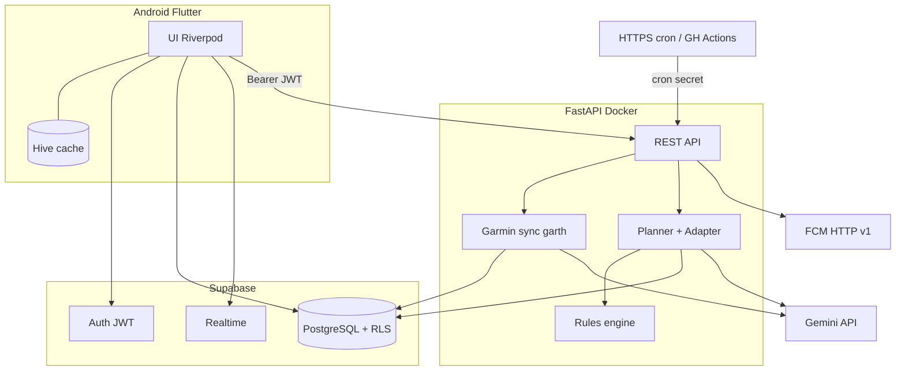

# DynamicRunner — POC architecture (one pager)

**Scope:** Android MVP — **Supabase** + **FastAPI** on **Render** or **Fly.io**. This doc is the compact picture; detail lives in [PRD §7–8](../PRD.md), [access-control](access-control.md), and [threat-model](threat-model.md).

---

## System diagram

---

## Responsibilities

| Piece | Role |
|---|---|
| **Flutter** | UX, offline cache; **`supabase_flutter`** for session + RLS-safe data + Realtime; **`firebase_messaging`** for device token only. |
| **Supabase Auth** | Email + Google; JWT claim **`sub`** = **`uid`** everywhere. |
| **Postgres + RLS** | User-owned rows (`user_id = auth.uid()`); indexes for active plan + workouts-by-date. |
| **Realtime** | Optional live updates (backfill, plan, sync status); polling acceptable where simpler. |
| **FastAPI** | Privileged routes: Garmin login/MFA, encrypt/decrypt tokens, agents, push-to-watch, GDPR, internal cron handlers. Verifies **Supabase JWT** on user routes. |
| **HTTPS cron** | Daily sync, weekly review, auto-push windows — calls **`/internal/*`** with **shared secret**, not user JWT. |
| **Gemini** | Planner (Pro) / Adapter (Flash); inputs from Postgres via tools. |
| **FCM** | Minimal Firebase project — **credentials only**; server sends pushes; no Firestore as source of truth. |

---

## Two client paths

1. **Supabase directly** — anon key + user session; **RLS** gates reads/writes for profile-like data, metrics, plans where policy allows.
2. **FastAPI** — same user **JWT** in `Authorization`; server uses **service role** or elevated DB access only inside the process for Garmin blobs, agents, and cron.

Never bundle the **service role key** or **cron secret** in the app.

---

## Secrets (POC)

| Secret | Lives |
|---|---|
| Supabase URL, anon key | App config (anon is public; **RLS** protects data). |
| Service role key | FastAPI env only. |
| `APP_ENCRYPTION_KEY` / Fernet material | FastAPI env — wraps Garmin OAuth ciphertext in Postgres. |
| Gemini API key | FastAPI env. |
| FCM service account / HTTP v1 creds | FastAPI env. |
| Cron / internal API secret | FastAPI env + cron provider config. |

---

## Out of scope for this POC

Managed AWS control plane (Cognito, AppSync, DynamoDB, EventBridge, KMS, Pinpoint), dual-region, and full Terraform — see **PRD §7 “Production / migration (AWS)”** and **§13a** when you need that path.

---

## Related links

- [PRD.md §7–9](../PRD.md) — full architecture, data model, Garmin flow  
- [access-control.md](access-control.md) — JWT, RLS, endpoint matrix  
- [threat-model.md](threat-model.md) — assets and mitigations  
- [TODO.md Phase 1–2](../TODO.md) — scaffold order  

**Last updated:** 2026-05-06
